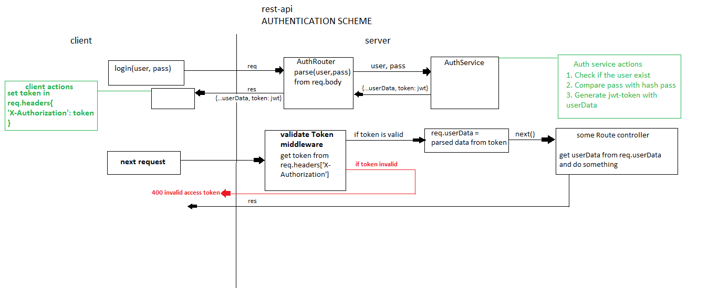

# rest-api-express-mongo

HOST: http://localhost:3001

## AUTHENTICATION LOGIC SCHEME


### AUTH

```javascript
>>> REGISTER <<<

fetch('http://localhost:3001/api/auth/register', {
    method: 'POST',
    headers: {
        'Content-Type': 'application/json'
    },
    body: JSON.stringify({
        username: 'some username',
        password: 'some password'
    })
});

Success response: 200 OK, {"_id": "...", "username": "...","accessToken": "..."}
// when you add accessToken from response in your request headers like that key: 'X-Authorization', value: accessToken, you can to send authenticated requests 
```

```javascript
>>> LOGIN <<<

fetch('http://localhost:3001/api/auth/login', {
    method: 'POST',
    headers: {
        'Content-Type': 'application/json'
    },
    body: JSON.stringify({
        username: 'some username',
        password: 'some password'
    })
});

Success response: 200 OK {"_id": "...", "username": "...","accessToken": "..."}
// when you add accessToken from response in your request headers like that key: 'X-Authorization', value: accessToken you can to send authenticated requests
```

```javascript
>>> LOGOUT <<<

fetch('http://localhost:3001/api/auth/logout', {
    method: 'GET',
    headers: {
        'Content-Type': 'application/json',
        'X-Authorization': 'here is your accessToken'
    }
});

Success response: 202 { "message": "You successfully logout." }
// after this request your current ассеssТoken becomes invalid
```


### USERS

```javascript
>>> Get User By Id <<<

fetch('http://localhost:3001/api/users/:id');

Success response: 200 OK {"_id": "...", "username": "...", "profilePicture": "...", "coverPicture": "...", "followers": [...], "following": [...]}
```

```javascript
>>> Edit User By Id <<<

//You can edit only your profile, must be authenticated with valid accessToken in request headers
//With this request you can edit this props: username, profilePicture, coverPicture, description

fetch('http://localhost:3001/api/users/:id', {
    method: 'PUT',
    headers: {
        'Content-Type': 'application/json',
        'X-Authorization': 'here is your accessToken'
    },
    body: JSON.stringify({
        username: 'some username',
        profilePicture: '//TODO...',
        coverPicture: '//TODO...',
        description: 'some description'
    });
});

Success response: 200 OK { "username": "...", "profilePicture": "...", "coverPicture": "...", "description": "..." } 
```

```javascript
>>> Delete User By Id <<<

//You can delete only your profile, must be authenticated with valid accessToken in request headers
//With this request you delete your profile permanently

fetch('http://localhost:3001/api/users/:id', {
    method: 'DELETE',
    headers: {
        'Content-Type': 'application/json',
        'X-Authorization': 'here is your accessToken'
    }
});

Success response: 202 { "message": "You delete successfully this user." } 
```

```javascript
>>> Follow User By Id <<<

//You can't follow yourself, must be authenticated with valid accessToken in request headers 

fetch('http://localhost:3001/api/users/:id/follow', {
    method: 'POST',
    headers: {
        'Content-Type': 'application/json',
        'X-Authorization': 'here is your accessToken'
    }
});

Success response: 202 { "message": "You follow successfully this user." } 
```

```javascript
>>> Unfollow User By Id <<<

//You can't unfollow yourself, must be authenticated with valid accessToken in request headers 

fetch('http://localhost:3001/api/users/:id/unfollow', {
    method: 'POST',
    headers: {
        'Content-Type': 'application/json',
        'X-Authorization': 'here is your accessToken'
    }
});

Success response: 202 { "message": "You unfollow successfully this user." } 
```

### POSTS

```javascript
>>> Get Post By Id <<<

fetch('http://localhost:3001/api/posts/:id');

Success response: 200 OK {"_id": "...", "owner": "...", "content": "...", "image": "...", "likes": [...], "createdAt": "...", "updatedAt": "..."}
```

```javascript
>>> Get All Posts From Current User <<<

//if posts from current user no exists response will be empty array
// this is the timeline for current user

fetch('http://localhost:3001/api/posts/from/:userId');

Success response: 200 OK [ posts... ]
```

```javascript
>>> Get NewsFeed posts<<<

//Must to be authenticated with valid access token to perform this request
//This request returns all posts from you followings users

fetch('http://localhost:3001/api/posts/news/followings');

Success response: 200 OK [ posts... ]
```

```javascript
>>> Create Post <<<

//Must be authenticated with valid token in request headers to perform this request

fetch('http://localhost:3001/api/posts/create', {
    method: 'POST',
    headers: {
        'Content-Type': 'application/json',
        'X-Authorization': 'here is your accessToken'
    },
    body: JSON.stringify({
        content: 'REQUIRED',
        image: 'NOT REQUIRED'
    })
});

Success response: 200 OK {"_id": "...", "owner": "...", "content": "...", "image": "...", "likes": [...], "createdAt": "...", "updatedAt": "..."}
```

```javascript
>>> Edit Post By Id<<<

//Must be authenticated with valid access token in request headers to perform this request,
//Must be a owner on current post to perform this request,
//Оnly this properties those you submit in the request body will be updated

fetch('http://localhost:3001/api/posts/:id', {
    method: 'PUT',
    headers: {
        'Content-Type': 'application/json',
        'X-Authorization': 'here is your accessToken'
    },
    body: JSON.stringify({
        content: 'REQUIRED',
        image: 'NOT REQUIRED'
    })
});

Success response: 200 OK { "this is a json with edited properties" }
```

```javascript
>>> Delete Post By Id<<<

//Must be authenticated with valid access token in request headers to perform this request,
//Must be a owner on current post to perform this request

fetch('http://localhost:3001/api/posts/:id', {
    method: 'DELETE',
    headers: {
        'Content-Type': 'application/json',
        'X-Authorization': 'here is your accessToken'
    }
});

Success response: 202 OK { "message": "You delete successfully this post."}
```

```javascript
>>> Like Post By PostId<<<

//Must be authenticated with valid access token in request headers to perform this request

fetch('http://localhost:3001/api/posts/:postId/like', {
    method: 'POST',
    headers: {
        'Content-Type': 'application/json',
        'X-Authorization': 'here is your accessToken'
    }
});

Success response: 202 OK { "message": "You successfully like this post."}
```

```javascript
>>> Unlike Post By PostId<<<

//Must be authenticated with valid access token in request headers to perform this request

fetch('http://localhost:3001/api/posts/:postId/unlike', {
    method: 'POST',
    headers: {
        'Content-Type': 'application/json',
        'X-Authorization': 'here is your accessToken'
    }
});

Success response: 202 OK { "message": "You successfully unlike this post."}
```